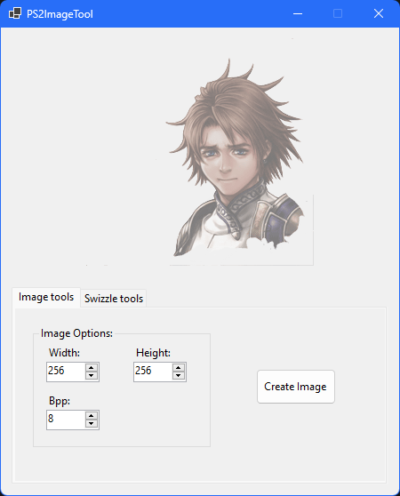

# PS2ImageTool 
 
  

# Usage
This tool only works on image files that have indexed palette or CLUT stored in a separate file or in a different section in the binary file. you have to separate both the pixel data and the palette data as separate files and save them with the .bin extension.

## Unswizzling
### Palette
PS2 palette data for 8bpp images are usually swizzled and would have to unswizzled for the final image to render correctly.

- Go to the Swizzle tools tab and select the "Palette Unswizzle" option. then click on the Unswizzle button and you will be prompted to select the palette file. this file should contain only the palette data, should be in RGBA color order, and has to be for a 8bpp image.

- Select the palette file that you have saved as a separate file and the tool should quickly unswizzle the file and save the data to a new file. this new file will have the same name as the file that you had selected, but will have a "_unswizzled" suffix added to the filename.

### Pixel
Sometimes PS2 pixel data can be swizzled and would have to be unswizzled for the final image to render correctly. this is a bit of an experimental process and you may have to do this only after checking how your final image file looks without the pixel file being unswizzled.

- Go to the Swizzle tools tab and select the "Pixel Unswizzle" option.

- Enter the dimensions and the bpp values for your image. these values requires some guess work from your end and if you are getting any exception errors, then then try a different set of values. 

- Click on the Unswizzle button and you will be prompted to select the pixel file. this file should contain only the pixel data and has to be for a 8bpp image.

- Select the pixel file that you have saved as a separate file and the tool should quickly unswizzle the file and save the data to a new file. this new file will have the same name as the file that you had selected, but will have a "_unswizzled" suffix added to the filename.

## Creating the image
- When you have your pixel and palette data files, go to the Image tools tab and enter the dimensions and the bpp values for your image. these values requires some guess work from your end and if the image doesn't look correct on the canvas, then then try a different set of values.

- After you have set the correct values, click on the "Create Image" button and you will be prompted to select the pixel file. this file should contain only the pixel data and if you had unswizzled the file before in the previous unswizzling step, then select the "_unswizzled" file.

- Select the pixel file and you will be prompted to select the palette file. this file should contain only the palette data and should be in RGBA color order.

- Select the palette file and you will be prompted as to whether you want to clamp the alpha values to 128. on a PS2, the max alpha range for a image is limited to a byte value of 128 and well if this was consistent, then clamping the alpha value automatically would have been a no brainer. but sometimes the image files would use the alpha values above 128 in different ways with the shader, thereby making the clamped image result look different compared to the image result that is rendered ingame. in this case, selecting the option to not clamp the value would provide the correct image result.

- After selecting your clamp choice, the image file will get converted and be drawn on the canvas. if it does not look proper, then try a different dimension value or with a unswizzled pixel or palette data.

- Once you are satisfied with the image, right click on the canvas and click the Save As... option.  You can save the image in the following formats:
  - PNG
  - DDS
  - BMP

- If you want to retain the alpha channel, then select either the PNG or DDS option. you can use IrfanView, HoneyView, GIMP, or Photoshop to view the dds image.

- If you do not want to retain the alpha channel, then select the BMP option.

# Credits
[**Mugi**](https://github.com/tehmugi) - for providing a C based code for the palette unswizzle algorithm.
